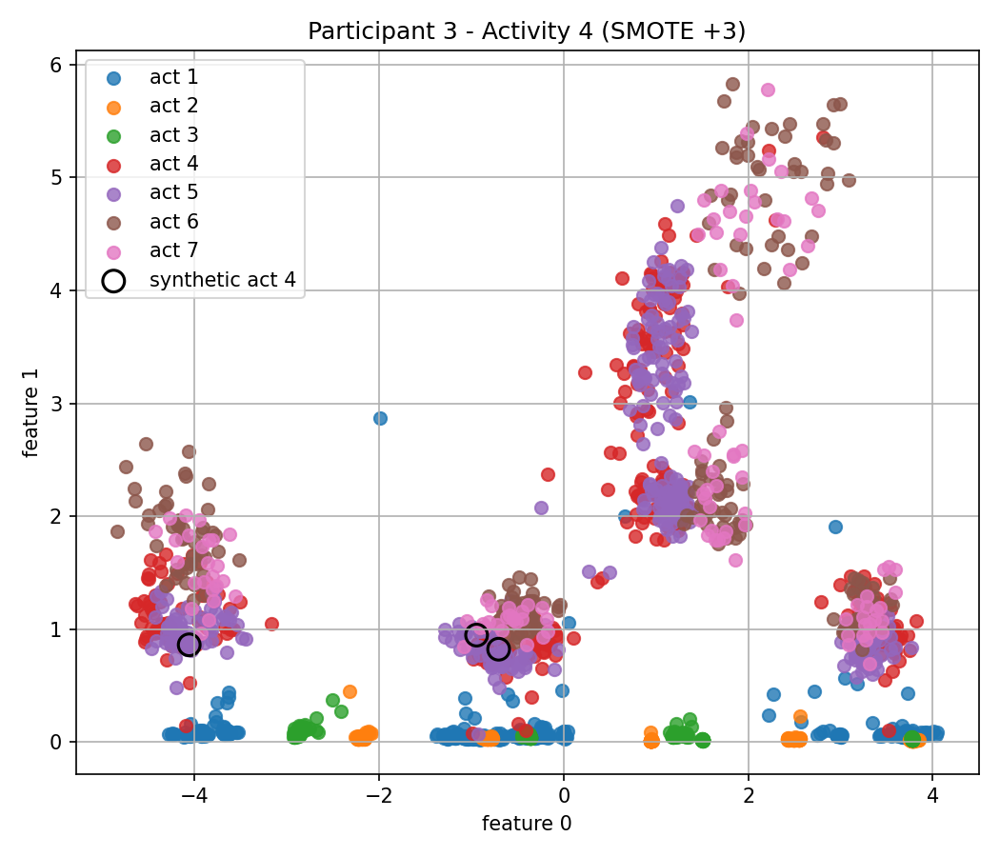

# Human Activity Recognition

Classification of human activities from wearable inertial sensors (accelerometer, gyroscope and magnetometer). The project covers the whole pipeline: outlier analysis, window-based feature extraction, feature selection, dimensionality reduction, pretrained deep-learning embeddings and a from-scratch kNN classifier evaluated under several scenarios.

University project for the *Extração e Classificação Automática de Conhecimento* (ECAC) course, Computer Engineering (LEI), University of Coimbra, 2025.

## Dataset

[FORTH-TRACE](data/raw/dataset/README.md) dataset (Karagiannaki, Panousopoulou, Tsakalides): 15 participants wearing 5 Shimmer sensor nodes, performing 16 activities (7 basic activities and 9 postural transitions). Signals: 3-axis accelerometer, gyroscope and magnetometer, sampled at ~51.2 Hz.

The raw data is **not** included in this repository. Download it from the original source and place it in `data/raw/dataset/`, so that the files are at `data/raw/dataset/partX/partXdevY.csv`.

## Pipeline

**Part 1 (`meta1/`)**

1. Boxplots of the sensor magnitude per activity
2. Outlier detection: z-score (k = 3, 3.5, 4), k-means (distance to centroid) and DBSCAN (bonus)
3. Statistical significance analysis between activities
4. Window-based feature extraction (temporal and spectral features; windows of 250 samples at 50 Hz, 252 features per window)
5. PCA (75% of the variance) and feature selection with Fisher score and ReliefF

**Part 2 (`meta2/`, `models/`)**

1. Class balance analysis (activities 1 to 7) and SMOTE implementation to generate synthetic windows
2. Deep-learning embeddings extracted with the pretrained [`harnet5`](https://github.com/OxWearables/ssl-wearables) model, as an alternative to hand-crafted features
3. Train / validation / test splits, *within-subject* and *between-subject*
4. Scenarios built on those splits: all features, PCA and ReliefF subsets
5. kNN classifier implemented from scratch, with `k` selected on the validation set and the final model evaluated on the test set
6. Prediction on new CSV files
7. Bonus: SMOTE balancing of a scenario and a LightGBM model tuned with Optuna

## Tech Stack

Python · NumPy · SciPy · scikit-learn · scikit-rebate · PyTorch · Matplotlib · LightGBM · Optuna

## Project Structure

| Path | Contents |
|---|---|
| `meta1/` | Part 1: `preprocessing/`, `outliers/` and `features/`, with the entry point `meta1_main.py` |
| `meta2/` | Part 2: `smote/`, `embeddings/`, `splits/`, `bonus/`, prediction scripts and the entry point `meta2_main.py` |
| `models/` | kNN classifier, evaluation and comparison of results |
| `utils/` | Configuration and progress helpers |
| `data/` | Dataset (not tracked) and generated files in `data/processed/` (not tracked) |
| `figures/` | Result figures |

## Getting Started

### Prerequisites

- Python 3.10+
- The FORTH-TRACE dataset in `data/raw/dataset/` (see above)

### Installation

```bash
python -m venv .venv
source .venv/bin/activate
pip install -r requirements.txt
```

### Usage

Run from the repository root, in this order (part 2 reuses the features generated by part 1):

```bash
python meta1/meta1_main.py
python meta2/meta2_main.py
```

Generated files are written to `data/processed/`, and the pretrained model is downloaded through `torch.hub` on first use. Trained models are not tracked in this repository, since they are large; they are regenerated by the code.

## Results

Part 1 figures are in [`meta1/results/Graficos`](meta1/results/Graficos) (boxplots, z-score, k-means and DBSCAN outliers).



## Authors

Simão Carvalho, Martim Costa Duarte · University of Coimbra · Computer Engineering · 2025
